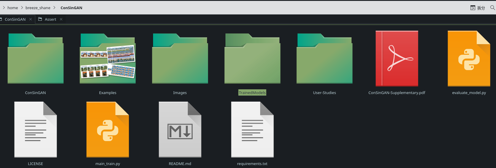
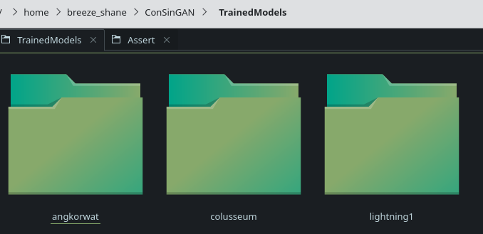
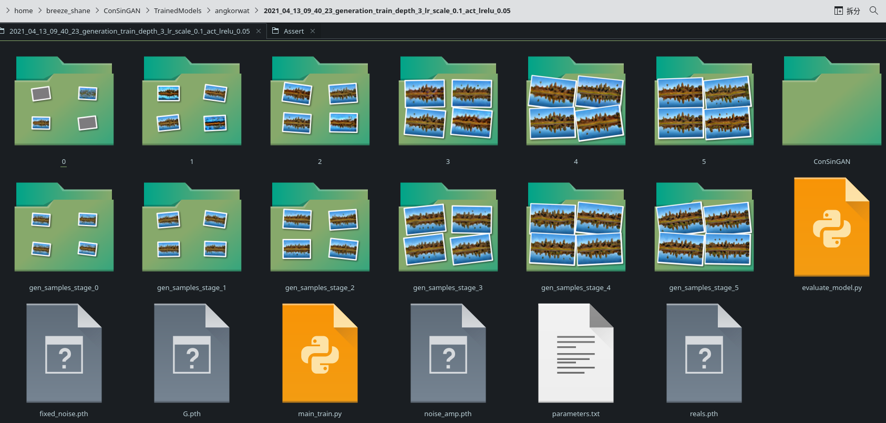
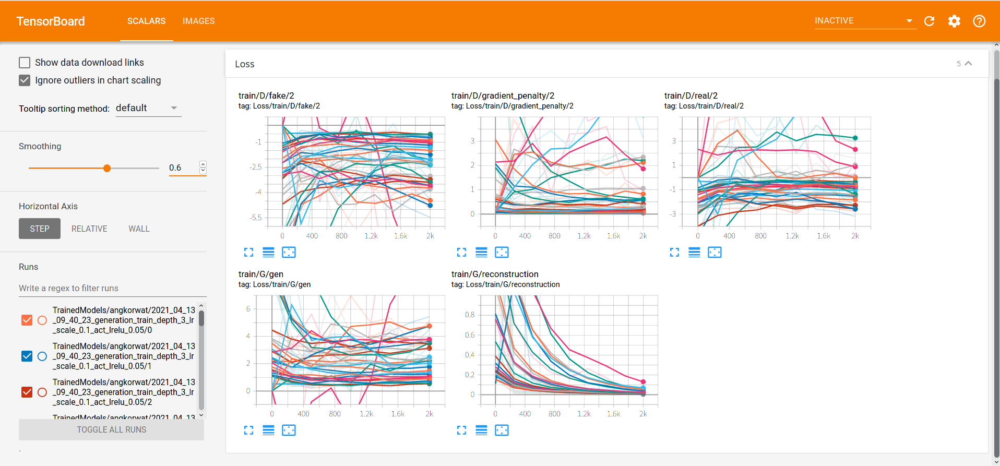
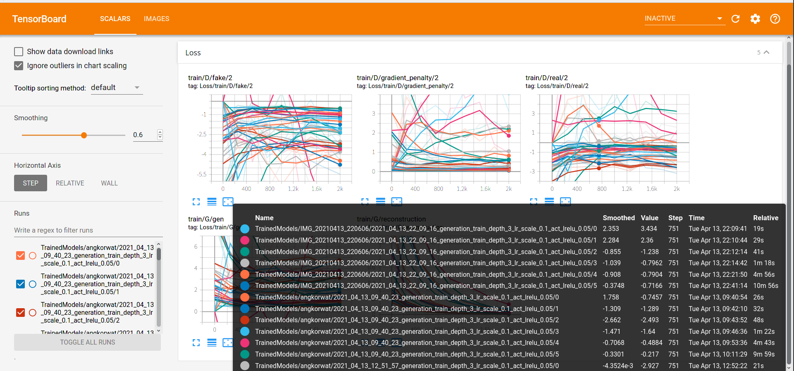
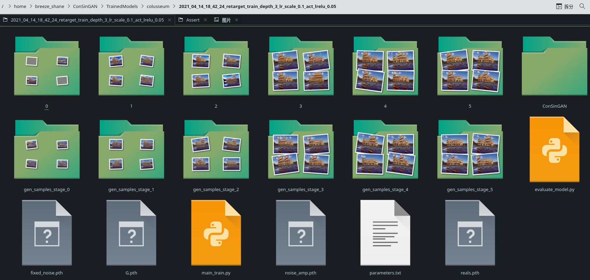

# 介绍、用法及其一些发现

## 1.介绍：

训练单图像生成对抗网络的改进技术：[原仓库地址 ](https://github.com/tohinz/ConSinGAN) [论文地址](https://openaccess.thecvf.com/content/WACV2021/papers/Hinz_Improved_Techniques_for_Training_Single-Image_GANs_WACV_2021_paper.pdf)

了解一个程序，首先从使用该程序入手，让自己直观感受到这个程序的作用。这回我是从头到尾好好地使用了这个repository！

首先值得大赞的是这个仓库的源代码下载好并装好相应环境（Python 3.5和Pytorch 1.1.0）之后就可以直接使用，非常方便！！！git clone之后我们进入这个目录就可以看到如下图：



翻看Images文件夹（当然你直接读文档也行。。。），我们不难发现它可以实现的功能是生成GIF动画、图像修复、生成图像、图形变换以及和谐化嵌入图像这五大功能。虽说都是GAN很常规的功能，但是这不影响我们去挖掘其中值得学习的东西！

读过文档之后，我们可以得知，训练出来的模型都会存在TrainedModels文件夹里，打开以后我们可以看到相应的各个分类：



打开任意一个文件夹，我们都会看到以时间和其它东西命名的文件夹（注意这些文件夹的名称在使用的过程中有用，如需要请记一下），再打开就会看到类似如下的界面：



这里就是你在那个时间进行训练时产生的模型。

其他文件夹也是同类如此。

## 2.用法：

想使用这个GAN，就要详细了解它的参数及其作用。

### (1)main_train.py参数

```
--input_name ---> 指定你要训练的图像
--naive_img ---> 
--gpu ---> 指定你想使用的GPU
--train_mode ---> 选择训练模式：generation，retarget，harmonization，editing，animation
--lr_scale ---> 指定学习率大小
--train_stages ---> 指定训练周期次数
--fine_tune ---> 
--model_dir ---> 
```

### (2)evaluate_model.py参数

```
--model_dir ---> 
--gpu ---> 指定你想使用的GPU
--num_samples ---> 
--naive_img ---> 
```

了解它们的参数后，我们使用的时候就可以按需有选择进行了！

```
python ×××.py 参数 值
```

大体上都是这种格式。

以下是参考例子，本文档会做一定的解读：

```shell
python main_train.py --gpu 0 --train_mode generation --input_name Images/Generation/angkorwat.jpg --lr_scale 0.5 --train_stages 7
# 此例是选择使用第一个GPU，选择生成模式，指定了Images/Generation/目录下的angkorwat.jpg，并设定了训练过程中的学习率为0.5，训练周期为7次
tensorboard --logdir .
# 运行这个会在本地上开启一个端口，用以显示各训练过程中各指标的函数曲线。效果图如下：
# 由于我选了不好的图片，现在看起来确实挺乱。。。
```





```shell
python evaluate_model.py --gpu 0 --model_dir TrainedModels/ANYWHERE/ANYWHERE/ --num_samples 50
# 此例是选择使用第一个GPU，指定TrainedModels/ANYWHERE/ANYWHERE/目录下的模型，并设定学习的循环次数（可能大概也许是吧？究竟是不是，我还需要完全分析之后才能得出结论。）
python main_train.py --gpu 0 --train_mode editing --batch_norm --niter 1000 --input_name Images/Editing/stone.png
# 目前确实没法理解niter参数到底是做什么用的，先在这里留下疑问，以后解决。。。
python main_train.py --gpu 0 --train_mode harmonization --train_stages 3 --min_size 120 --lrelu_alpha 0.3 --niter 1000 --batch_norm --input_name Images/Harmonization/scream.jpg
# lrelu_alpha参数和batch_norm参数是什么还需全面剖析才能解答，这个也是以后理解了我会继续补充。。。至于那个min_size参数我看仓库介绍是说指定最小图片的大小，按作者所说，如果适当修改这一参数大小的话有可能更快也得到更好的结果。
python evaluate_model.py --gpu 0 --model_dir TrainedModels/scream/.../ --naive_img Images/Harmonization/scream_naive.jpg
# 翻看文件夹，发现除了scream.jpg和scream_naive.jpg之外，还有scream_naive_mask.jpg这个图片，就目前所学我还是无法确定它们之间的关系，尤其是那个mask更不知所云，还是只能等我全面剖析了这个项目才能明白。
```

## 3.其他发现：

### (1)温度、时间、空间上的哲（shǎ）学（mào）问题

我运行了一下生成图像模式，训练得到的输出信息如下：

```
stage [0/5]:: 100%|███████████████████████████████████| 2000/2000 [00:53<00:00, 37.19it/s]
stage [1/5]:: 100%|███████████████████████████████████| 2000/2000 [01:12<00:00, 27.59it/s]
stage [2/5]:: 100%|███████████████████████████████████| 2000/2000 [01:51<00:00, 18.00it/s]
stage [3/5]:: 100%|███████████████████████████████████| 2000/2000 [03:16<00:00,  7.68it/s]
stage [4/5]:: 100%|███████████████████████████████████| 2000/2000 [12:47<00:00,  1.75it/s]
stage [5/5]:: 100%|███████████████████████████████████| 2000/2000 [28:26<00:00,  1.28s/it]
```

从中我们发现这速度越来越慢，当时跑这个代码的时候我的电脑都是挺热的，后来因为训练的太多，导致屏幕出现了局部卡顿的异常现象。于是起初我觉得速度这样变化是和温度有较大关系，但是当我添加了涡轮散热器之后才发现，即使添加了，并且温度保持稳定而不过高的时候，我发现速度只是提高了4～5 it/s，于是我打开了训练模型文件夹查看了一下，发现：



不难看出，随着周期的增加，图像也在逐渐增大，这也必然意味着运算的复杂程度正在增加，因此才会出现上面每进行一次就会下滑10左右的it/s，而温度其实反而影响不会太大。不过能省时间就省时间嘛，金钱换时间也没什么亏的（手动滑稽）（其实我是因为怕电脑跑着跑着死机了。。。上回就出现了异常情况，我可不希望再有意外了。。。）

至少通过这个我们发现，目前GAN生成图像还存在着较大的局限性，比如图像增大的话相应需要的算力也越多，如果在GPU配置相对固定的情况下，消耗的时间也是膨胀得越来越快（像上面那个例子，运行第五周期所需时间几乎是上一次的四倍，到第六周期又是上一次的两倍，时间长的吓人）。况且在这次生成的图像最大也只有250×188的大小，平均所占的空间仅有26.1KB，试想如果和我们平时在使用的图像相比，这个显然小了太多，几乎没法使用，而如果要生成我们最期望的大小（1980×1024 1080P），简直无法估计这样需要多长时间。。。。。

### (2)对于弱监督学习的理解

通过这段时间的学习，我发现所谓的弱监督学习原来真的是这样：

由人告诉机器××是什么，并把相应的数据（比如图片、视频、音频等等）传给机器，机器开始看这些数据，并且自己不断产生噪声（这里就是在模拟人类的想象过程）然后再判定自己产生的是不是“真的”，如果不是真的就再重新“想象”，直到确信自己产生的是“真的”为止（这里就相当于人类认为自己模仿得不够逼真时会再重新尝试，直到自己确信足够逼真为止）。弱，只是指人类只告诉机器××是什么，而剩下的标签（或者说是次要信息）则由机器自己去挖掘去学习。

那么我们也不难理解有些人说弱监督学习是一门仿生学科的原因了。同时我们也不难看得出GAN具有着惊人的潜力，因为它确实似乎在像人类一样想象，尽管净是许许多多的不切实际甚至不可能应该有的想象。

上面那个过程已经表明GAN网络的组成成分了，分两大部分：一是生成器，一是判别器。噪声就由生成器产生，由判别器确定它所生成的是否为真。

